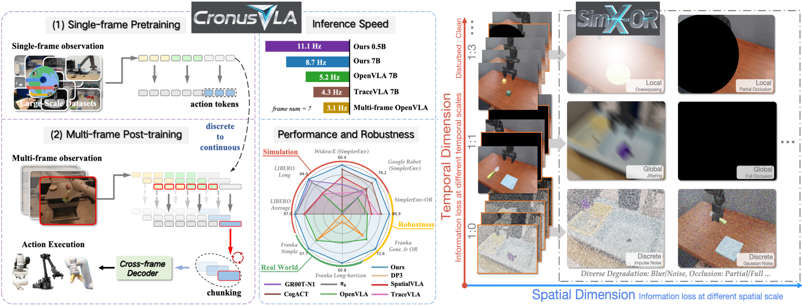
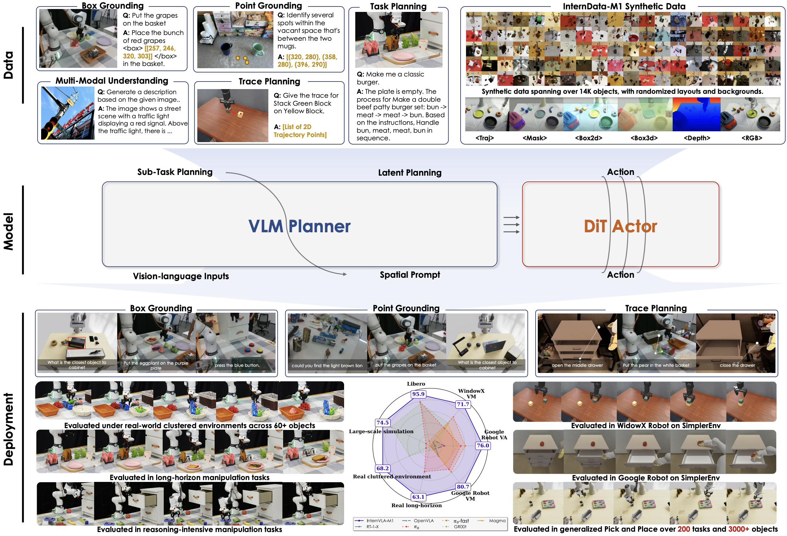
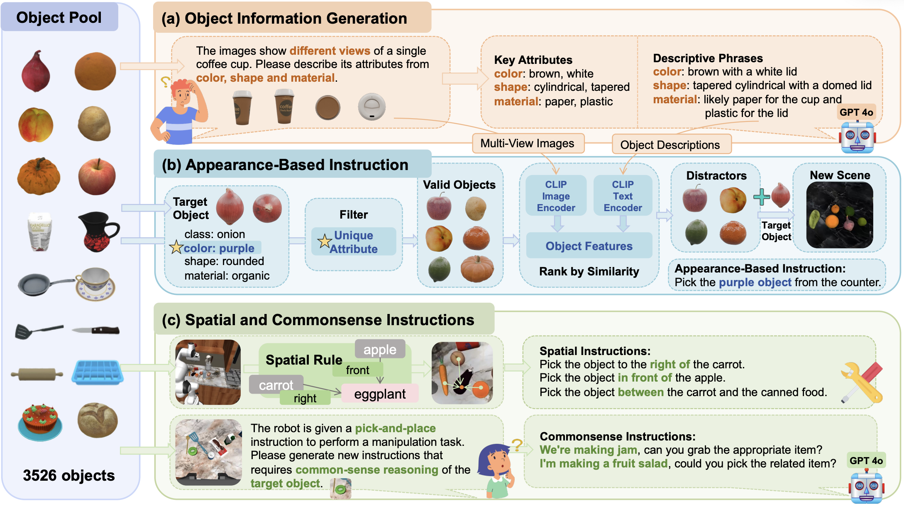
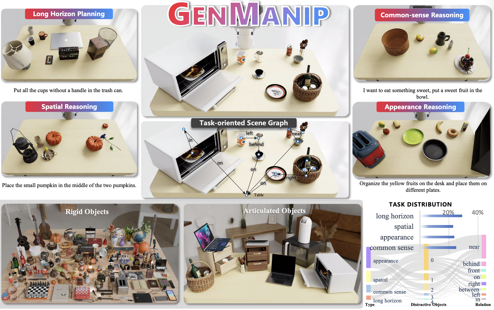
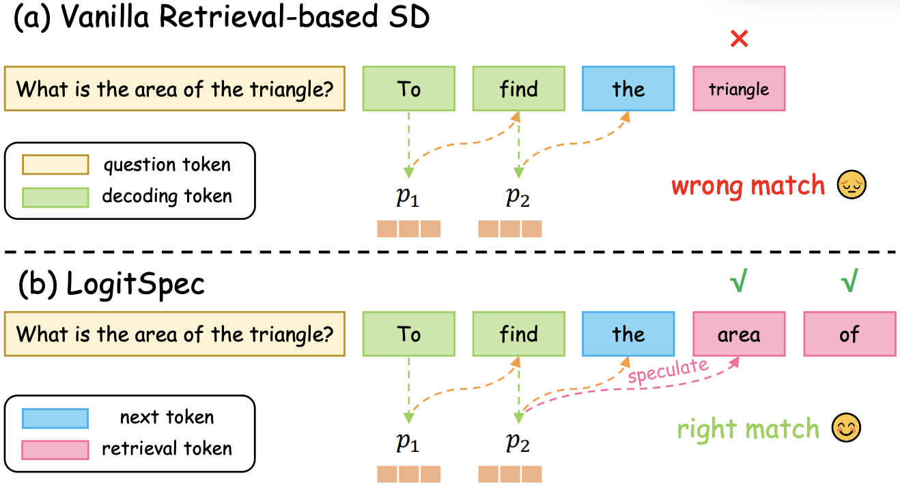
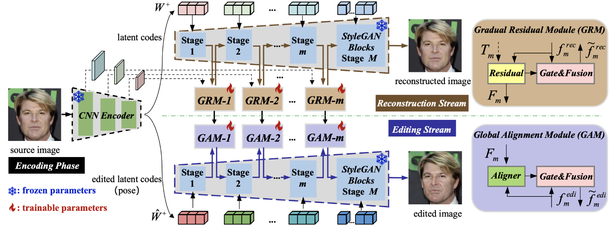
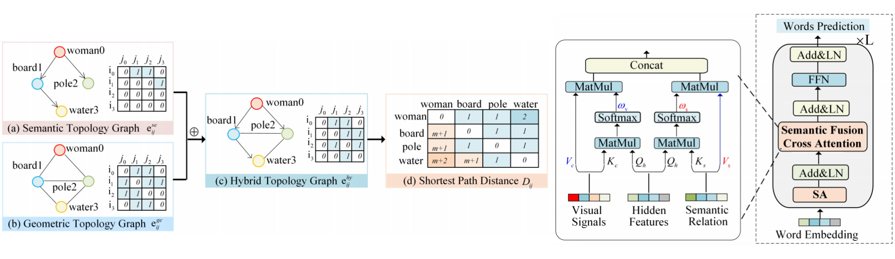
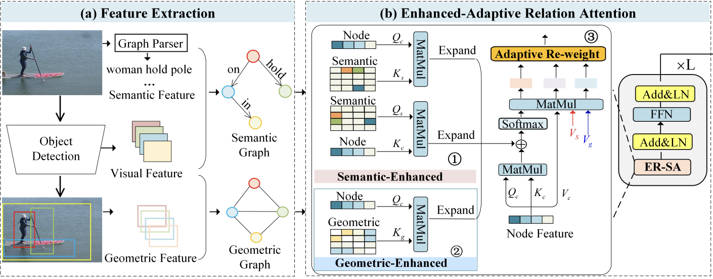








I am currently a second-year Ph.D. student at [Shanghai AI Laboratory](https://www.shlab.org.cn/) and [University of Science and Technology of China (USTC)](https://www.ustc.edu.cn/), co-supervised by [Jiangmiao Pang](https://oceanpang.github.io/), [Feng Zhao](https://en.auto.ustc.edu.cn/2021/0616/c26828a513169/page.htm), and [Dahua Lin](http://dahua.site/). Prior to my Ph.D., I spent two years in the graduate program at USTC under the supervision of [Yongdong Zhang](https://imcc.ustc.edu.cn/_upload/tpl/0d/13/3347/template3347/zhangyongdong.html/). I obtained my B.Eng. degree at [Huazhong University of Science and Technology (HUST)](https://english.hust.edu.cn/) in 2022. I joined InternRobotics in 2024.06, where my mentor is [Yilun Chen](https://yilunchen.com/about/).

My research interest lies in the field of Robotics, particularly VLA models, I also have research interests and experience in AIGC (world model, image generation/editing) and multimodal learning.

# 🔥 News
- 2025.11: 🎉 CronusVLA got accepted to AAAI 2026 as a **oral** presentation. 
- 2025.10: 💪 Code of [InstructVLA](https://github.com/InternRobotics/InstructVLA), [CronusVLA](https://github.com/InternRobotics/CronusVLA) and [SimX-OR](https://github.com/LiHaoHN/SimX-OR) were released. 
- 2025.09: 💪 [InternVLA-M1](https://arxiv.org/abs/2510.13778) was released. 
- 2025.07: 💪 [InstructVLA](https://arxiv.org/abs/2507.17520) was released. 
- 2025.07: 💪 [LogitSpec](https://arxiv.org/abs/2507.01449) was released. 
- 2025.06: 💪 [CronusVLA](https://arxiv.org/abs/2506.19816) was released. 
- 2025.03: 🎉 [GenManip](https://openaccess.thecvf.com/content/CVPR2025/papers/Gao_GENMANIP_LLM-driven_Simulation_for_Generalizable_Instruction-Following_Manipulation_CVPR_2025_paper.pdf) got accepted to CVPR 2025. 
- 2025.03: 🎉 [RoboGround](https://openaccess.thecvf.com/content/CVPR2025/html/Huang_RoboGround_Robotic_Manipulation_with_Grounded_Vision-Language_Priors_CVPR_2025_paper.html) got accepted to CVPR 2025. 
- 2024.06: 🌟 I joined InternRobotics, where my mentor is [Yilun Chen](https://yilunchen.com/about/).
- 2024.01: 🎉 Our system for the *Efficient and Controllable Text-to-Image Generation* in the [2nd International Algorithm Case Competition (IACC) of the Greater Bay Area](https://iacc.pazhoulab-huangpu.com/) was awarded **Second Prize in the Grand Finals (2/599, prize ¥200,000)**, where I served as the first contributor, and [video of my presentation](https://www.bilibili.com/video/BV12b4y1L7h2/?spm_id_from=333.1387.upload.video_card.click) was released.
- 2023.12: 🎉 [VG-Cap](https://dl.acm.org/doi/abs/10.1145/3638558) got accepted to TOMM, and [code](https://github.com/CrossmodalGroup/ER-SAN) was released. 
- 2023.11: 🎉 [GradStyle]((https://ojs.aaai.org/index.php/AAAI/article/view/28089)) got accepted to AAAI. 
- 2022.04: 🎉 [ER-SAN](https://web.archive.org/web/20220717185244id_/https://www.ijcai.org/proceedings/2022/0148.pdf) got accepted to IJCAI as a **oral** presentation.

# 📝 Publications 

(†: corresponding author; * :equal contribution)

<!-- AnySplat -->

AAAI 2026 (Oral)

**CronusVLA: Towards Efficient and Robust Manipulation via Multi-Frame Vision-Language-Action Modeling**

**Hao Li\***,
[Shuai Yang*](https://github.com/YangS03/about_me/blob/main/resume_shuai_2025.pdf/),
[Yilun Chen†](https://yilunchen.com/about/),
[Xinyi Chen](),
[Xiaoda Yang](),
[Yang Tian](),
[Hanqing Wang](https://hanqingwangai.github.io/),
[Tai Wang](https://tai-wang.github.io/),
[Dahua Lin](http://dahua.site/),
[Feng Zhao†](https://scholar.google.co.uk/citations?user=r6CvuOUAAAAJ&hl=en),
[Jiangmiao Pang†](https://oceanpang.github.io/)

[[**Project**]](https://lihaohn.github.io/CronusVLA.github.io/)&nbsp;
[[**Paper**]](https://arxiv.org/abs/2506.19816)&nbsp;
[[**Code of Models**]](https://github.com/InternRobotics/CronusVLA)&nbsp;
[[**Code of Benchmark**]](https://github.com/LiHaoHN/SimX-OR)

<!-- AnySplat -->

<!-- MVColight -->

Preprint 2025

**InstructVLA: Vision-Language-Action Instruction Tuning from Understanding to Manipulation**

[Shuai Yang*](https://github.com/YangS03/about_me/blob/main/resume_shuai_2025.pdf/),
**Hao Li\***,
[Bing Wang](https://yilunchen.com/about/),
[Yilun Chen](https://yilunchen.com/about/),
[Yang Tian](),
[Tai Wang](https://tai-wang.github.io/),
[Hanqing Wang](https://hanqingwangai.github.io/),
[Feng Zhao](https://scholar.google.co.uk/citations?user=r6CvuOUAAAAJ&hl=en),
[Yiyi Liao](https://yiyiliao.github.io/),
[Jiangmiao Pang](https://oceanpang.github.io/)

[[**Project**]](https://yangs03.github.io/InstructVLA_Home/)&nbsp;
[[**Paper**]](https://arxiv.org/abs/2507.17520)&nbsp;
[[**Code**]](https://github.com/OpenRobotLab/InstructVLA)

<!-- MVColight -->

<!-- ObjectGS -->

Technical Report 2025

**InternVLA-M1: A Spatially Grounded Foundation Framework for Generalist Robot Policy**

**Hao Li**;
[InternVLA-M1 Team](https://ruijiezhu94.github.io/ruijiezhu/)

[[**Project**]](https://internrobotics.github.io/internvla-m1.github.io)&nbsp;
[[**Paper**]](https://arxiv.org/abs/2510.13778)&nbsp;
[[**Code**]](https://github.com/InternRobotics/InternVLA-M1)

<!-- ObjectGS -->

<!-- V3DG -->

CVPR 2025

**RoboGround: Robotic Manipulation with Grounded Vision-Language Priors**

[Haifeng Huang](),
[Xinyi Chen](),
[Yilun Chen](), 
**Hao Li**,
[Xiaoshen Han](), 
[Zehan Wang](), 
[Tai Wang](), 
[Jiangmiao Pang](), 
[Zhou Zhao](), 

[[**Project**]](https://robo-ground.github.io/)&nbsp;
[[**Paper**]](https://arxiv.org/pdf/2504.21530)&nbsp;
[[**Code**]](https://github.com/ZzZZCHS/RoboGround)

<!-- V3DG -->

<!-- Scene4U -->

CVPR 2025

**GENMANIP: LLM-driven Simulation for Generalizable Instruction-Following Manipulation**

[Ning Gao](),
[Yilun Chen](),
[Shuai Yang](),
[Xinyi Chen](),
[Yang Tian](),
**Hao Li**,
[Haifeng Huang](),
[Hanqing Wang](),
[Tai Wang](),
[Jiangmiao Pang](),

[[**Project**]](https://genmanip.com/)&nbsp;
[[**Paper**]](https://arxiv.org/abs/2506.10966)&nbsp;
[[**Code**]](https://github.com/OpenRobotLab/GenManip)

<!-- Scene4U -->

<!-- Horizon-GS -->

Preprint 2025

**LogitSpec: Accelerating Retrieval-based Speculative Decoding via Next Next Token Speculation**

[Tianyu Liu](),
[Qitan Lv](),
**Hao Li**,
[Xing Gao](),
[Xiao Sun]()

[[**Project**]](https://github.com/smart-lty/LogitSpec)&nbsp;
[[**Paper**]](https://arxiv.org/abs/2507.01449)&nbsp;
[[**Code**]](https://github.com/smart-lty/LogitSpec)

<!-- Horizon-GS -->

<!-- Octree-GS -->

AAAI 2024

**Gradual Residuals Alignment: A Dual-Stream Framework for GAN Inversion and Image Attribute Editing**

**Hao Li**,
[Mengqi Huang](),
[Lei Zhang](),
[Bo Hu](),
[Yu Liu](),
[Zhengdong Mao†]()

[[**Project**]](https://arxiv.org/pdf/2402.14398v1)&nbsp;
[[**Paper**]](https://ojs.aaai.org/index.php/AAAI/article/view/28089)&nbsp;
[[**Code**]](https://ojs.aaai.org/index.php/AAAI/article/view/28089)

<!-- Octree-GS -->

<!-- GSDF -->

TOMM 2024

**Exploring visual relationships via transformer-based graphs for enhanced image captioning**

[Jingyu Li](),
[Zhendong Mao†](),
**Hao Li**,
[Weidong Chen](),
[Yongdong Zhang]()

[[**Project**]](https://github.com/CrossmodalGroup/ER-SAN)&nbsp;
[[**Paper**]](https://dl.acm.org/doi/abs/10.1145/3638558)&nbsp;
[[**Code**]](https://github.com/CrossmodalGroup/ER-SAN/tree/main/VG-Cap)

<!-- GSDF -->

<!-- PAD -->

IJCAI Oral 

**ER-SAN: Enhanced-Adaptive Relation Self-Attention Network for Image Captioning**

[Jingyu Li](),
[Zhendong Mao†](),
[Shancheng Fang](),
**Hao Li**

[[**Project**]](https://github.com/CrossmodalGroup/ER-SAN)&nbsp;
[[**Paper**]](https://web.archive.org/web/20220717185244id_/https://www.ijcai.org/proceedings/2022/0148.pdf)&nbsp;
[[**Code**]](https://github.com/CrossmodalGroup/ER-SAN)

<!-- PAD -->

# 🎖 Honors and Awards
- The First Prize Scholarship, USTC, 2024
- **National Scholarship (Top 2%), USTC, 2024**
- The First Prize Scholarship, USTC, 2023
- The First Prize Scholarship, USTC, 2022
- Outstanding Graduate Student, HUST, 2022
- **Outstanding Undergraduate in Terms of Academic Performance (Top 1%), HUST, 2020**

# 📖 Experience
### Educations
- Ph.D. in Control Science and Engineering of [University of Science and Technology of China](https://www.ustc.edu.cn/) & [Shanghai AI Laboratory](https://www.shlab.org.cn/), 2024.06 - present
- Graduate program in Information and Communication Engineering of [University of Science and Technology of China](https://www.ustc.edu.cn/), 2022.09 - 2024.05
- B.S. in School of Electronic Information and Communications of [Huazhong University of Science and Technology](https://english.hust.edu.cn/), 2018.09 - 2022.06
  - Electronic Information Engineering (Mathematical Improvement Experimental Class), Rank: 3/30

### Internships
- *2024.06 - present*, in [InternRobotics of Shanghai AI Lab](https://www.shlab.org.cn/)

# 🧐 Community Services

**Reviewer**

- AAAI: 2025, 2026
- CVPR: 2024, 2025
- ICLR: 2025
- ICML: 2025

# 💻 Links

- Personal Email: lihaohn@mail.ustc.edu.cn
- WeChat: lihaohn_Jeas
- RedNote(Xiaohongshu): [5236901971](https://www.xiaohongshu.com/user/profile/621ed43a000000001000b1e3)