

I am currently a second-year Ph.D. student (2024.06-2027.06 expected) at [University of Science and Technology of China (USTC)](https://www.ustc.edu.cn/),  jointly trained with [Shanghai Artificial Intelligence Laboratory](https://www.shlab.org.cn/), co-supervised by [Dr. Jiangmiao Pang](https://oceanpang.github.io/), [Prof. Feng Zhao](https://en.auto.ustc.edu.cn/2021/0616/c26828a513169/page.htm), and [Prof. Dahua Lin](http://dahua.site/). Prior to my Ph.D., I spent two years in the graduate program at USTC under the supervision of [Prof. Yongdong Zhang](https://imcc.ustc.edu.cn/_upload/tpl/0d/13/3347/template3347/zhangyongdong.html/). I received my B.Eng. with honors from [Huazhong University of Science and Technology (HUST)](https://english.hust.edu.cn/) in 2022.

My research focuses on Robotics and Embodied AI, particularly Vision-Language-Action (VLA) models and World-Action Models (WAMs). I am also interested in VLM Brains and Embodied World Models. My experience spans model architecture design, large-scale training, data pipeline construction, benchmark evaluation, and real-world robotic system deployment in Embodied AI.

# 🔥 News
- 2026.07: 🎉 [InternVLA-A1.5](https://arxiv.org/abs/2607.04988) was released, a new unified foundation model that integrates world modeling and improve compositional generalization in embodied manipulation.
- 2026.06: 💪 [EBench](https://arxiv.org/abs/2606.18239) is officially released! We invite VLA and WAM models to undergo comprehensive evaluation with EBench. Check out the [project repository](https://github.com/InternRobotics/EBench/)!
- 2026.05: 💪 We propose [RoboInter1.5](https://arxiv.org/abs/2607.18709), which extends intermediate representations to World Modeling, unlocking a new dimension for structured physical world prediction.
- 2026.04: 🎉 [Robo3R](https://arxiv.org/pdf/2602.10101) got accepted to RSS 2026, congratulations to Sizhe Yang!
- 2026.03: 💪 [FutureVLA](https://arxiv.org/pdf/2603.10712) was released.
- 2026.02: 💪 Data, Benchmark, Model of [RoboInter](https://lihaohn.github.io/RoboInter.github.io/) were open source, and [Robo3R](https://arxiv.org/pdf/2602.10101) was released. 
- 2026.02: 🎉 [RoboInter](https://arxiv.org/abs/2602.09973) and [InstructVLA](https://arxiv.org/abs/2507.17520) got accepted to ICLR 2026. 
- 2026.01: 🎉 We get Second Place Award (2/62) of [RoCo Challenge](https://rocochallenge.github.io/RoCo2026/) @ AAAI 2026: Robotic Collaborative Assembling for Human-Centered Manufacturing. 
- 2025.11: 🎉 [CronusVLA](https://arxiv.org/abs/2506.19816) got accepted to AAAI 2026 as a **oral** presentation. 
- 2025.10: 💪 Code of [InstructVLA](https://github.com/InternRobotics/InstructVLA), [CronusVLA](https://github.com/InternRobotics/CronusVLA) and [SimX-OR](https://github.com/LiHaoHN/SimX-OR) were open source. 
- 2025.09: 💪 [InternVLA-M1](https://arxiv.org/abs/2510.13778) was released. 
- 2025.06: 💪 [CronusVLA](https://arxiv.org/abs/2506.19816) was released. 
- 2025.03: 🎉 Our [GenManip](https://openaccess.thecvf.com/content/CVPR2025/papers/Gao_GENMANIP_LLM-driven_Simulation_for_Generalizable_Instruction-Following_Manipulation_CVPR_2025_paper.pdf) and [RoboGround](https://openaccess.thecvf.com/content/CVPR2025/html/Huang_RoboGround_Robotic_Manipulation_with_Grounded_Vision-Language_Priors_CVPR_2025_paper.html) got accepted to CVPR 2025. 
- 2024.06: 🌟 I joined Shanghai AI Lab.
- 2024.01: 🎉 Our system for the *Efficient and Controllable Text-to-Image Generation* in the [2nd International Algorithm Case Competition (IACC) of the Greater Bay Area](https://iacc.pazhoulab-huangpu.com/) was awarded **Second Prize in the Grand Finals (2/599, prize ¥200,000)**, where I served as the first contributor, and [video of my presentation](https://www.bilibili.com/video/BV12b4y1L7h2/?spm_id_from=333.1387.upload.video_card.click) was released.

# 📝 Publications 

(* :equal contribution; ‡: project leader; †: corresponding author)

Technical Report 2026
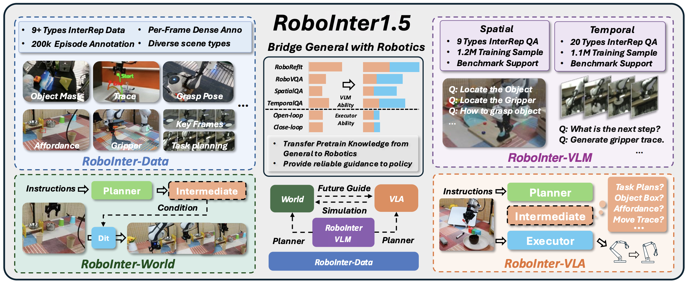

**RoboInter1.5: A Holistic Intermediate Representation Suite for Embodied World Modeling and Robotic Manipulation**

**Hao Li\***,
**Ziqin Wang\***,
[Weijun Wang](),
[Junhao Cai](),
[Jia Zeng](),
[Yilun Chen](),
[Jiangmiao Pang](https://oceanpang.github.io/),
[Si Liu](https://iai.buaa.edu.cn/info/1013/1096.htm),

[[**Project**]](https://lihaohn.github.io/RoboInter.github.io/)&nbsp;
[[**Paper**]](https://arxiv.org/abs/2607.18709)&nbsp;
[[**Code**]](https://github.com/InternRobotics/RoboInter)&nbsp;
[[**Data**]](https://huggingface.co/datasets/InternRobotics/RoboInter-Data)

Technical Report 2026
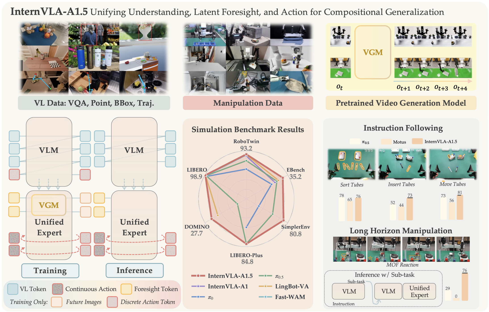

**InternVLA-A1.5: Unifying Understanding, Latent Foresight, and Action for Compositional Generalization**

**Hao Li*(core contributor), Team of InternVLA-A1.5.**

[[**Project**]](https://internrobotics.github.io/internvla-a15.github.io/)&nbsp;
[[**Paper**]](https://arxiv.org/pdf/2607.04988)&nbsp;
[[**Code**]](https://github.com/InternRobotics/InternVLA-A-series)&nbsp;
[[**Model**]](https://huggingface.co/collections/InternRobotics/internvla-a15)

Technical Report 2026 & ICLR 2026
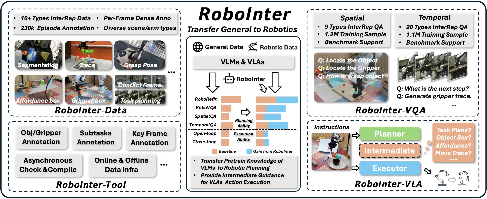

**RoboInter: A Holistic Intermediate Representation Suite Towards Robotic Manipulation**

**Hao Li**,
[Ziqin Wang](),
[Zi-han Ding](),
[Shuai Yang](),
[Yilun Chen‡](),
[Yang Tian](),
[Xiaolin Hu](),
[Tai Wang](),
[Dahua Lin](http://dahua.site/),
[Feng Zhao†](https://scholar.google.co.uk/citations?user=r6CvuOUAAAAJ&hl=en),
[Si Liu†](https://iai.buaa.edu.cn/info/1013/1096.htm),
[Jiangmiao Pang†](https://oceanpang.github.io/)

[[**Project**]](https://lihaohn.github.io/RoboInter.github.io/)&nbsp;
[[**Paper**]](https://arxiv.org/pdf/2602.09973)&nbsp;
[[**Code**]](https://github.com/InternRobotics/RoboInter)&nbsp;
[[**Data**]](https://huggingface.co/datasets/InternRobotics/RoboInter-Data)

<!-- AnySplat -->

AAAI 2026 (Oral)
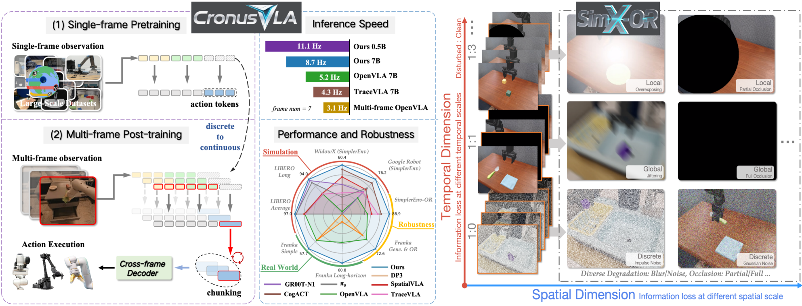

**CronusVLA: Towards Efficient and Robust Manipulation via Multi-Frame Vision-Language-Action Modeling**

**Hao Li**,
[Shuai Yang](https://github.com/YangS03/about_me/blob/main/resume_shuai_2025.pdf/),
[Yilun Chen†](https://yilunchen.com/about/),
[Xinyi Chen](),
[Xiaoda Yang](),
[Yang Tian](),
[Hanqing Wang](https://hanqingwangai.github.io/),
[Tai Wang](https://tai-wang.github.io/),
[Dahua Lin](http://dahua.site/),
[Feng Zhao†](https://scholar.google.co.uk/citations?user=r6CvuOUAAAAJ&hl=en),
[Jiangmiao Pang†](https://oceanpang.github.io/)

[[**Project**]](https://lihaohn.github.io/CronusVLA.github.io/)&nbsp;
[[**Paper**]](https://arxiv.org/abs/2506.19816)&nbsp;
[[**Code of Models**]](https://github.com/InternRobotics/CronusVLA)&nbsp;
[[**Code of Benchmark**]](https://github.com/LiHaoHN/SimX-OR)

<!-- AnySplat -->

<!-- MVColight -->

ICLR 2026
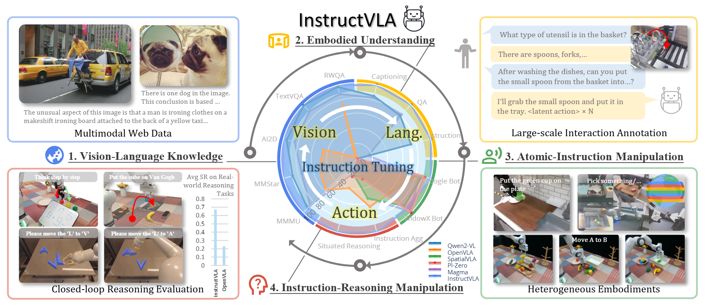

**InstructVLA: Vision-Language-Action Instruction Tuning from Understanding to Manipulation**

[Shuai Yang*](https://github.com/YangS03/about_me/blob/main/resume_shuai_2025.pdf/),
**Hao Li\***,
[Bing Wang](https://yilunchen.com/about/),
[Yilun Chen‡](https://yilunchen.com/about/),
[Yang Tian](),
[Tai Wang](https://tai-wang.github.io/),
[Hanqing Wang](https://hanqingwangai.github.io/),
[Feng Zhao](https://scholar.google.co.uk/citations?user=r6CvuOUAAAAJ&hl=en),
[Yiyi Liao](https://yiyiliao.github.io/),
[Jiangmiao Pang](https://oceanpang.github.io/)

[[**Project**]](https://yangs03.github.io/InstructVLA_Home/)&nbsp;
[[**Paper**]](https://arxiv.org/abs/2507.17520)&nbsp;
[[**Code**]](https://github.com/OpenRobotLab/InstructVLA)

Technical Report 2025
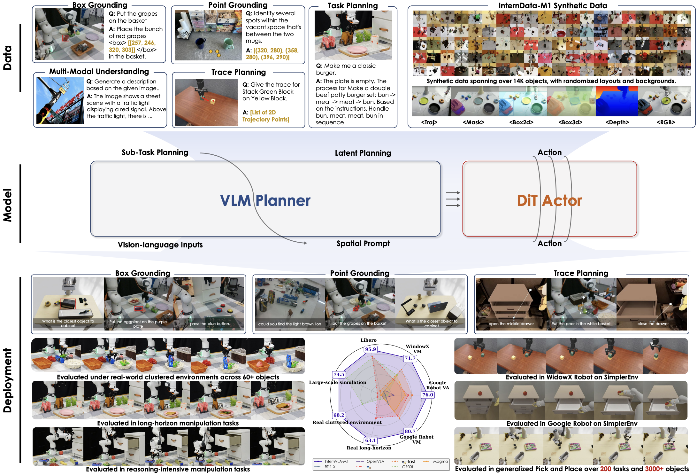

**InternVLA-M1: A Spatially Grounded Foundation Framework for Generalist Robot Policy**

[InternVLA-M1 Team]()

[[**Project**]](https://internrobotics.github.io/internvla-m1.github.io)&nbsp;
[[**Paper**]](https://arxiv.org/abs/2510.13778)&nbsp;
[[**Code**]](https://github.com/InternRobotics/InternVLA-M1)

Preprint 2026
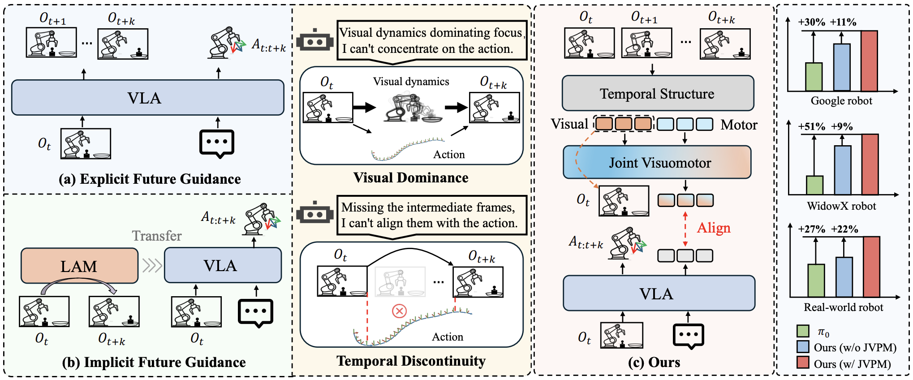

**FutureVLA: Joint Visuomotor Prediction for Vision-Language-Action Model.**

[Xiaoxu Xu](),
**Hao Li\*‡**,
[Bing Wang](https://yilunchen.com/about/),
[Jinhui Ye](),
[Yilun Chen](https://yilunchen.com/about/),
[Jia Zeng](),
[Xinyi Chen](),
[Linning Xu](),
[Dahua Lin](),
[Weixin Li](),
[Jiangmiao Pang](https://oceanpang.github.io/)

[[**Project**]](https://xuxiaoxxxx.github.io/projects/futurevla/)&nbsp;
[[**Paper**]]()&nbsp;
[[**Code**]]()

<!-- ObjectGS -->

<!-- GRA -->

AAAI
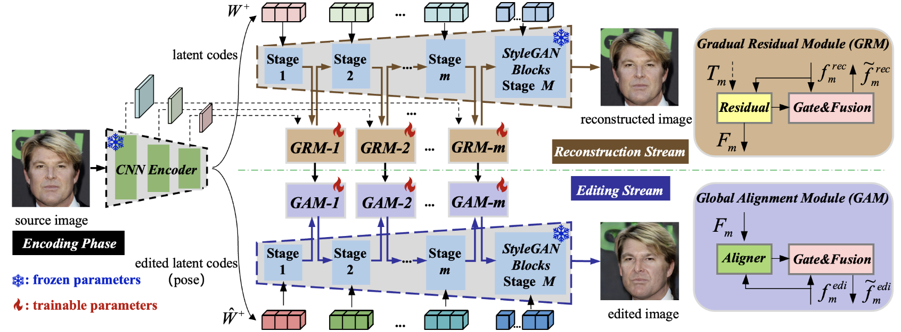

**Gradual Residuals Alignment: A Dual-Stream Framework for GAN Inversion and Image Attribute Editing**

**Hao Li**,
[Mengqi Huang](),
[Lei Zhang](),
[Bo Hu](),
[Yu Liu](),
[Zhengdong Mao]()

[[**Project**]]()&nbsp;
[[**Paper**]](https://ojs.aaai.org/index.php/AAAI/article/view/28063)&nbsp;
[[**Code**]]()

<!-- GRA -->

<!-- MVColight -->

RSS 2026
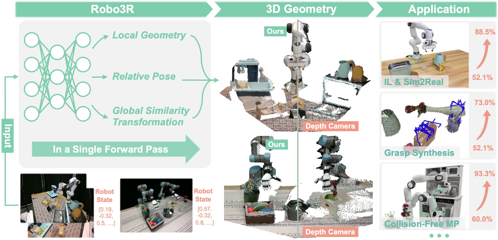

**Robo3R: Enhancing Robotic Manipulation with Accurate Feed-Forward 3D Reconstruction**

[Sizhe Yang](),
[Linning Xu]()†,
**Hao Li**,
[Juncheng Mu](),
[Jia Zeng](),
[Dahua Lin](https://tai-wang.github.io/),
[Jiangmiao Pang](https://oceanpang.github.io/)†

[[**Project**]](https://yangsizhe.github.io/robo3r/)&nbsp;
[[**Paper**]](https://arxiv.org/pdf/2602.10101)&nbsp;
[[**Code**]](https://github.com/InternRobotics/Robo3R)

<!-- MVColight -->

<!-- ObjectGS -->

<!-- V3DG -->

CVPR 2025
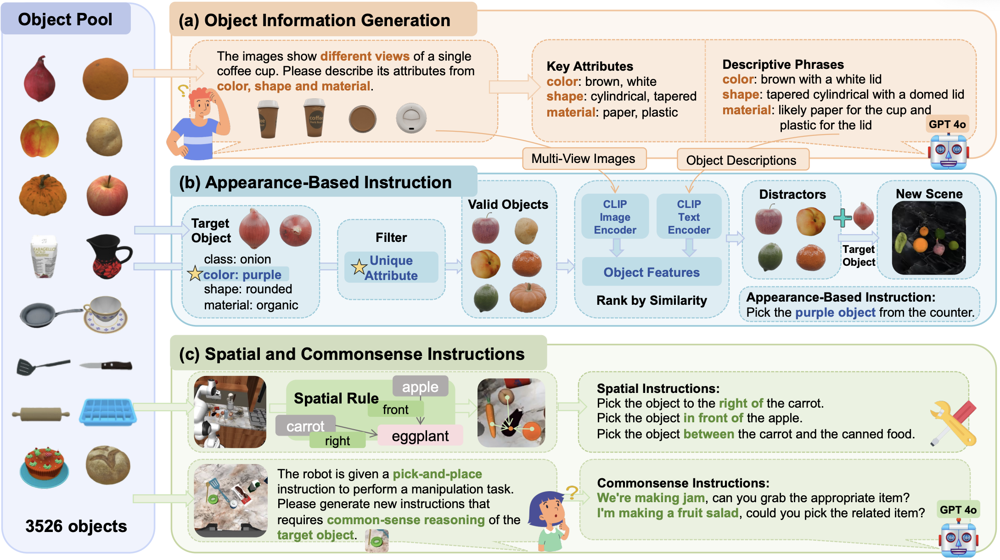

**RoboGround: Robotic Manipulation with Grounded Vision-Language Priors**

[Haifeng Huang](),
[Xinyi Chen](),
[Yilun Chen](), 
**Hao Li**,
[Xiaoshen Han](), 
[Zehan Wang](), 
[Tai Wang](), 
[Jiangmiao Pang](), 
[Zhou Zhao](), 

[[**Project**]](https://robo-ground.github.io/)&nbsp;
[[**Paper**]](https://arxiv.org/pdf/2504.21530)&nbsp;
[[**Code**]](https://github.com/ZzZZCHS/RoboGround)

<!-- V3DG -->

<!-- Scene4U -->

<!-- 

CVPR 2025
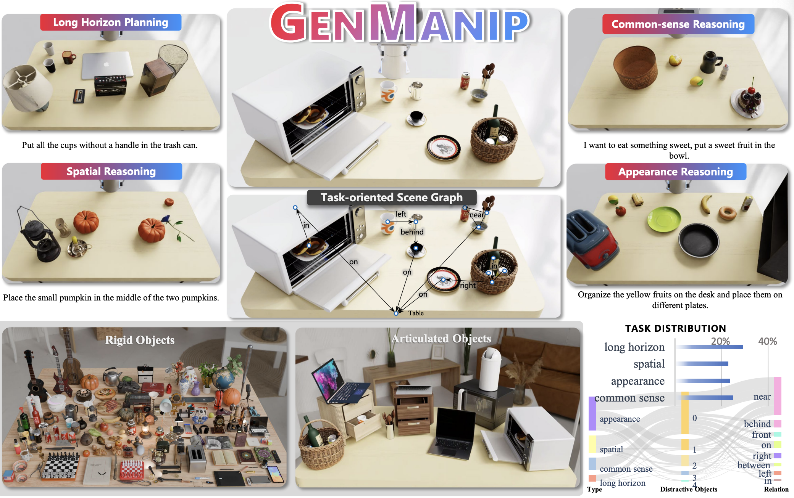

**GENMANIP: LLM-driven Simulation for Generalizable Instruction-Following Manipulation**

[Ning Gao](),
[Yilun Chen](),
[Shuai Yang](),
[Xinyi Chen](),
[Yang Tian](),
**Hao Li**,
[Haifeng Huang](),
[Hanqing Wang](),
[Tai Wang](),
[Jiangmiao Pang](),

[[**Project**]](https://genmanip.com/)&nbsp;
[[**Paper**]](https://arxiv.org/abs/2506.10966)&nbsp;
[[**Code**]](https://github.com/OpenRobotLab/GenManip)

 -->
<!-- Scene4U -->

<!-- Horizon-GS -->

<!-- 

Preprint 2025
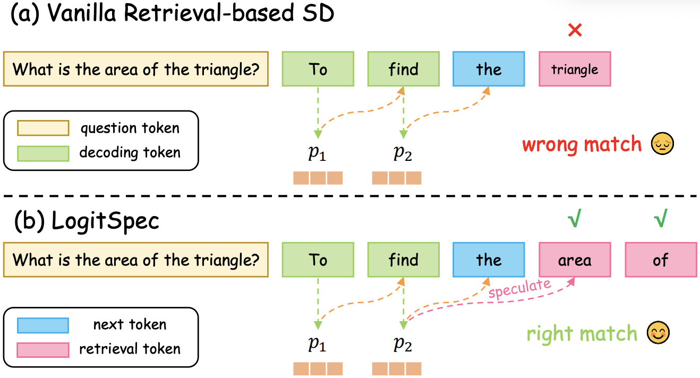

**LogitSpec: Accelerating Retrieval-based Speculative Decoding via Next Next Token Speculation**

[Tianyu Liu](),
[Qitan Lv](),
**Hao Li**,
[Xing Gao](),
[Xiao Sun]()

[[**Project**]](https://github.com/smart-lty/LogitSpec)&nbsp;
[[**Paper**]](https://arxiv.org/abs/2507.01449)&nbsp;
[[**Code**]](https://github.com/smart-lty/LogitSpec)

<!-- Horizon-GS -->

<!-- GSDF -->

<!-- PAD -->

IJCAI Long Oral 
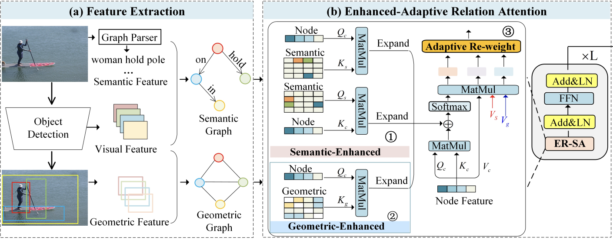

**ER-SAN: Enhanced-Adaptive Relation Self-Attention Network for Image Captioning**

[Jingyu Li](),
[Zhendong Mao†](),
[Shancheng Fang](),
**Hao Li**

[[**Project**]](https://github.com/CrossmodalGroup/ER-SAN)&nbsp;
[[**Paper**]](https://web.archive.org/web/20220717185244id_/https://www.ijcai.org/proceedings/2022/0148.pdf)&nbsp;
[[**Code**]](https://github.com/CrossmodalGroup/ER-SAN)

<!-- PAD -->

# 🎖 Honors and Awards
- **Second Place Award (2/62)** of RoCo Challenge @ AAAI 2026: Robotic Collaborative Assembling for Human-Centered Manufacturing
- **Second Prize (2/599, ¥200,000)** of the 2nd International Algorithm Case Competition of Greater Bay Area, Track of Efficient and Controllable Text-to-Image Generation
- **National Scholarship (Top 2%), Ministry of Education of China, 2024**
- The First Prize Scholarship, USTC, 2025, 2024, 2023, 2022
- Outstanding Graduate, HUST, 2022
- **Outstanding Undergraduate in Terms of Academic Performance (Top 1%), HUST, 2020**

# 📖 Experience
### Educations
- Ph.D. in Control Science and Engineering of [University of Science and Technology of China](https://www.ustc.edu.cn/) & Shanghai Artificial Intelligence Laboratory, 2024.06 - 2027.06 (expected)
- Graduate program in Information and Communication Engineering of [University of Science and Technology of China](https://www.ustc.edu.cn/), 2022.09 - 2024.06
- B.S. in School of Electronic Information and Communications of [Huazhong University of Science and Technology](https://english.hust.edu.cn/), 2018.09 - 2022.06
  - Electronic Information Engineering (Mathematical Improvement Experimental Class)

<!-- ### Internships
- *2024.06 - present*, in [Shanghai AI Lab](https://www.shlab.org.cn/) -->
### Internships
- Research intern in Shanghai AI Lab.

# 🧐 Community Services

**Reviewer**

- AAAI 2025–2026, CVPR 2024–2025, ICLR 2025, ICML 2025, etc.

# 💻 Links

- Personal Email: lihaohn@mail.ustc.edu.cn
- WeChat: lihaohn_Jeas
- RedNote(Xiaohongshu): [5236901971](https://www.xiaohongshu.com/user/profile/621ed43a000000001000b1e3)
